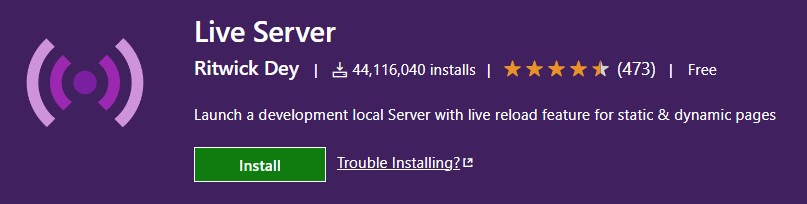
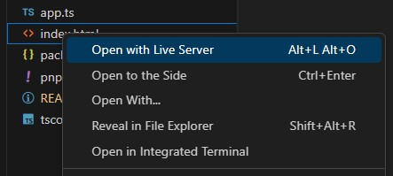

# Typescript - Auto compile on save

Auto compile TypeScript files on save and browser page reload.

Basic setup for TypeScript project.

This simple configuration allows you to automatically recompile the TypeScript `.ts` files and reload the project in the browser when saving.

## Required

[TypeScript](https://www.typescriptlang.org/) programming language.

<a href="https://www.typescriptlang.org/" target="_blank" title="TypeScript">
  
</a>

[Live Server](https://marketplace.visualstudio.com/items?itemName=ritwickdey.LiveServer) - used to reload the project in the browser.

<a href="https://marketplace.visualstudio.com/items?itemName=ritwickdey.LiveServer" target="_blank" title="VisualStudio Marketplace - Live server">
  
</a>

## Features
- TypeScript in project or global installation.
- On save:
  - Auto compile `.ts` file in `.js`;
  - Auto reload in browser.

## Tutorial

Install Live Server extension in Visual Studio Code:

> [VisualStudio  Marketplace | Live Server](https://marketplace.visualstudio.com/items?itemName=ritwickdey.LiveServer)

Create project folder with [index.html](index.html) and [app.ts](app.ts) files.

From Terminal:
- init the project
  ```terminal
  pnpm init
  ```

- install [Typescript](https://www.typescriptlang.org/download)
  ```terminal
  pnpm add typescript -D
  ```

- create [tsconfig.json](tsconfig.json)
  ```terminal
  pnpm tsc --init
  ```

Add command to start project in [package.json](package.json)
```json
"scripts": {
  "start": "tsc -w"
}
```

Open [index.html](index.html) with Live Server



From Terminal run the project
```
pnpm start
```

When changes are saved, `app.ts` is recompiled and browser reloads the page

## Usage

Just download and install node modules.